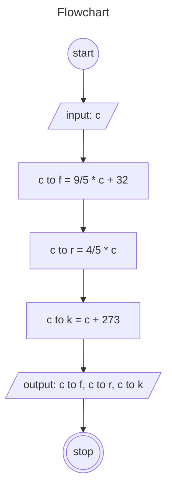

# Algoritma Konversi Suhu Celcius ke Fahrenheit, Reamur dan Kelvin

1. mulai
2. tentukan nilai celcius
3. ubah celsius ke fahrenheit dengan menambah nilai celsius dengan 32 lalu dikalikan 9/5
4. ubah celsius ke reamur dengan mengkalikan nilai celcius dengan 4/5
5. ubah celsius ke kelvin dengan menambahkan nilai celsius dengan 273
6. tampilkan nilai konversi celsius ke fahrenheit, reamur dan kelvin
7. selesai

