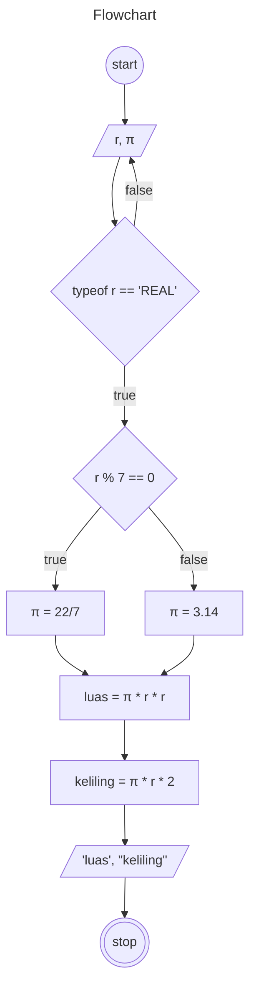

# Algoritma Menghitung Luas dan Keliling Lingkaran

1. Mulai
1. Tentukan *jari-jari* lingkaran sebagai "r"
1. Jika "r" bilangan riil maka lanjut langkah 5
1. Jika tidak maka kembali ke langkah 2
1. Jika "r" habis dibagi 7 maka "phi" adalah **22/7**
1. Jika tidak maka "phi" adalah **3,14**
1. Kalikan "phi" dengan "r"yang dikuadratkan untuk menghitung luas lingkaran
1. Kalikan "phi" dengan "r" lalu kalikan 2 untuk menghitung keliling lingkaran
1. Selesai


## Pseudocode

```
DECLARE r: REAL
DECLARE phi: REAL
DECLARE luas: REAL
DECLARE keliling: REAL

INPUT r

WHILE TYPEOF r == REAL
    IF r MOD 7 == 0 THEN
        phi <- 22/7
    ELSE
        phi <- 3.14
    ENDIF
ENDWHILE

luas <- phi * r * r
keliling <- 2 * phi * r

OUTPUT "luas lingkaran adalah: ", luas
OUTPUT "keliling lingkran adalah: ", keliling

```