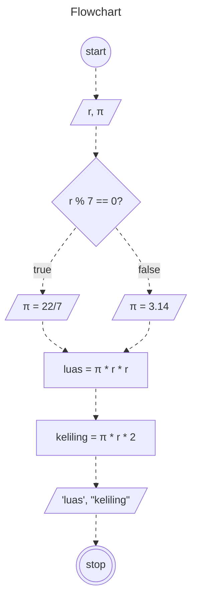

# Algoritma Menghitung Luas dan Keliling Lingkaran

1. Mulai
2. Tentukan *jari-jari* lingkaran
3. Apabila *jari-jari* habis dibagi 7 maka $phi$ = **22/7**
4. Apabila tidak maka $phi$ = **3,14**
5. Kalikan $phi$ dengan *jari-jari* yang dikuadratkan untuk menghitung luas lingkaran
6. Kalikan $phi$ dengan *jari-jari* lalu kalikan 2 untuk menghitung keliling lingkaran
7. Selesai

