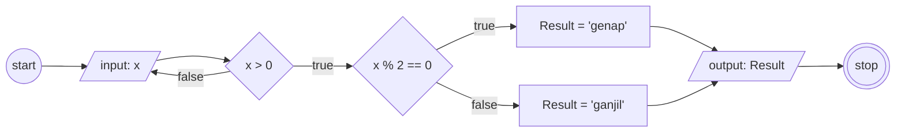

# Algoritma Menentukan Bilangan Ganjil dan Genap

1. mulai
1. tentukan sebuah bilangan sebagai "x"
1. jika "x" lebih besar dari 0 maka lanjut langkah 5
1. jika tidak maka ulangi ke langkah 2
1. bagi "x" dengan 2
1. jika "x" habis dibagi 2 maka hasilnya adalah "genap", lanjut langkah 8
1. jika tidak maka hasilnya adalah "ganjil"
1. tampilkan hasil
1. selesai


## Flowchart


## Pseudocode

```
// Program menentukan bilangan ganjil dan genap

DECLARE x: INTEGER
DECLARE Result: STRING

INPUT x

WHILE x > 0
    IF x MOD 2 = 0 THEN
        Result <- "genap"
    ELSE
        Result <- "ganjil"
ENDWHILE

OUTPUT "Nomor", x, "adalah", Result
```