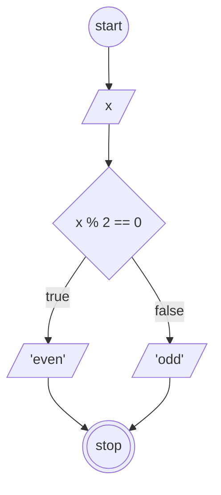

# Algoritma Menentukan Bilangan Ganjil dan Genap

1. mulai
2. tentukan sebuah bilangan
3. bagi bilangan tersebut dengan 2
4. apabila hasilnya bilangan bulat maka bilangan tersebut genap, lanjut langkah 6
5. apabila hasilnya bukan bilangan bulat maka bilangan tersebut ganjil
6. selesai



## Pseudocode

```
// Program menentukan bilangan ganjil dan genap

DECLARE Number: INTEGER
DECLARE Result: STRING

IF Number MOD 2 = 0 THEN
    Result <- "genap"
ELSE
    Result <- "ganjil"
ENDIF

OUTPUT "Nomor", Number, "adalah", Result
```