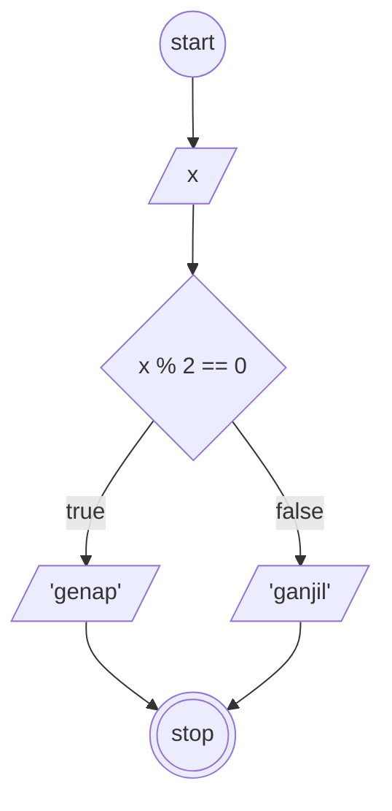

# Algoritma Menentukan Bilangan Ganjil dan Genap

1. mulai
2. tentukan sebuah bilangan sebagai "x"
3. bagi "x" dengan 2
4. apabila hasilnya habis dibagi 2 maka "x" adalah genap, lanjut langkah 6
5. apabila tidak maka "x" adalah ganjil
6. selesai


## Flowchart


## Pseudocode

```
// Program menentukan bilangan ganjil dan genap

DECLARE x: INTEGER
DECLARE Result: STRING

IF x MOD 2 = 0 THEN
    Result <- "genap"
ELSE
    Result <- "ganjil"
ENDIF

OUTPUT "Nomor", x, "adalah", Result
```